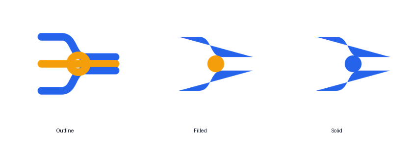

# Frontend Concurrency Lab — Brand and Logo System

## Concept

The mark is a minimal abstract interpretation of the project behavior rather than a literal illustration. It uses the same 64-unit grid, rounded geometry, and two-color logic as the rest of the portfolio family.

- Primary color: `#2563EB` (`--color-brand`)
- Accent color: `#F59E0B` (`--color-accent`)
- Dark canvas: `#0F172A` (`--color-canvas`)
- Light surface: `#F8FAFC` (`--color-surface`)

## Asset inventory

| Asset | Intended use |
|---|---|
| `brand/logo-outline.svg` | Architecture diagrams, low-density documentation, monochrome-friendly layouts. |
| `brand/logo-filled.svg` | README hero, product cards, documentation home. |
| `brand/logo-solid.svg` | Small navigation marks, stamps, badges, watermark use. |
| `brand/logo-lockup.svg` | Repository header and marketing/documentation header. |
| `brand/favicons/favicon.svg` | Modern browser favicon. |
| `brand/favicons/favicon-16x16.png` | Browser tab fallback. |
| `brand/favicons/favicon-32x32.png` | Browser tab/high-density fallback. |
| `brand/favicons/favicon-48x48.png` | Windows and legacy icon contexts. |
| `brand/favicons/favicon-64x64.png` | High-density UI. |
| `brand/favicons/favicon-128x128.png` | Documentation/social tooling. |
| `brand/favicons/apple-touch-icon.png` | iOS home screen. |
| `brand/favicons/android-chrome-192x192.png` | PWA icon. |
| `brand/favicons/android-chrome-512x512.png` | PWA install and maskable source. |
| `brand/favicons/favicon.ico` | Multi-resolution legacy favicon. |
| `brand/favicons/site.webmanifest` | PWA metadata baseline. |

## Usage constraints

- Minimum digital size: 16px for the solid mark, 24px for outline/filled variants.
- Clear space: at least one eighth of the mark width.
- Do not rotate, stretch, recolor, add shadows, or place the outline mark on visually noisy media.
- On the brand-colored favicon background, use the white solid glyph only.
- README and documentation must use repository-owned assets with relative paths.
- Any future logo change requires updating the design-token file and regenerating every favicon size.
